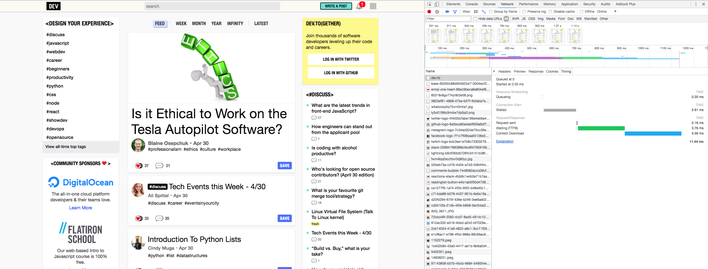

# [dev.to]を開いてみよう

[dev.to]: https://dev.to/

---

## [dev.to]

- 開発者向け情報投稿サービス
- 「**表示が爆速**」ということで話題になった
- The Practical Dev社によって開発運営されている
- 彼らは[**New York Cityを拠点としている**](https://dev.to/about)

---

## ブラウザの開発者ツールで見てみよう

- 別の講義でも紹介済みのはず
- macOSのChromeなら`Alt(Option) + Cmd + i`
    - 長い付き合いになるはずだ

(2018/05/01のある時刻に取得した画像)
