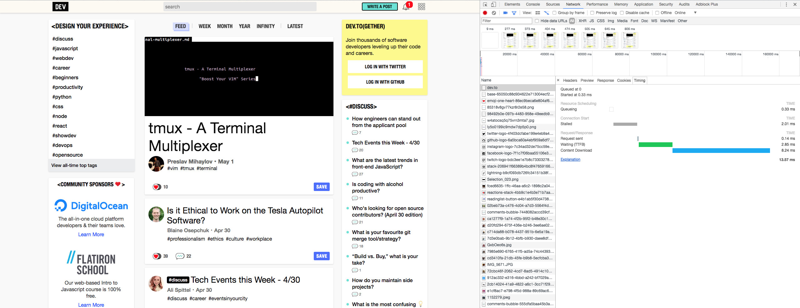

## 再び[dev.to]

[dev.to]: https://dev.to/

- ここまでさらったところで、改めて dev.to を閲覧した時の状況を見てみる

---

## 気づけること

- そもそも`dev.to`としか要求していない、つまり「ファイルパス」を与えていないにもかかわらず、意味のある情報が返ってきている
- `https://dev.to`という単一の URL を要求しただけなのに、大量のリクエストが付随して発生している
- **13ms という速さ** で`dev.to`に対する冒頭のリクエストが完了している
- **さっきの画像と中身が違う**
- (ほかにも挙げてみよう)

---

> - そもそも`dev.to`としか要求していない、つまり「ファイルパス」を与えていないにもかかわらず、意味のある情報が返ってきている

- 実は Web サーバは、必ずしも「ファイル」を明示的に要求されて、それを返さなければならないというわけではない
  - 「**送信すべき情報**」が確定したのであれば、Web サーバはそれを送信する自由がある
  - `dev.to`(hostname)だけを要求された場合はサイトの「トップページ」を要求されたものとみなしている
    - 同じ慣習を採用している Web サーバは多い
    - 逆に、古典的なファイルベースのサイトでは「トップページ」を意味するファイル実体として
      `index.html`などの"index"という名前を持つファイルを持っていることが多い
      - 「古典的」といっても、悪い意味ではない。この方式は現在も頻繁に使われる
  - `dev.to`と要求された Web サーバは、
    - 「トップページ」の実体として存在するファイルを読み出して、その中身を送信しているのかもしれないし、
    - あるいは実体としてのファイルは Web サーバの記憶装置には存在せず、要求されたときにプログラムが都度生成しているのかもしれない
    - この 2 パターンはどちらもありうるが、 **クライアントから見た場合は区別できない**
      - 結局の所クライアントに送り届けられるのはバイナリデータにすぎず、
        Web ブラウザ等がそれを意味ある情報として解釈できる限りにおいては平等に扱われる

---

> - `https://dev.to`という単一の URL を要求しただけなのに、大量のリクエストが付随して発生している

- これは HTML 文書、およびそれを解釈して描画する機能の一環として、
  「その文書自体とは別で存在する何らかのファイル」を追加で取得できる機能による
  - たとえば CSS, JS, 画像, 動画, 別の HTML など、様々なものを対象にできる
  - ("Type"列を眺めてみよう)

---

> - **13ms という速さ** で`dev.to`に対する冒頭のリクエストが完了している

- ここで以下を思い出して欲しい:

  > - 彼らは[**New York City を拠点としている**](https://dev.to/about)

---

- 約 10,000km

---

- インターネットを成り立たせている通信回線網の根幹部分は光ファイバーケーブルからなる
- つまり 1 本のケーブル内での伝送速度は光速が上限となる(約 300,000km/s)が、
  当然ながらケーブル内部で反射・屈折を繰り返すので、直線とはならない
  - 実用上は 200,000km/s 程度を上限とするらしい
- そして、極めて短い時間単位の光の on/off を元に、0 と 1 からなるバイナリデータを表現する
  - このへんあまりに大雑把だが、本文書の対象とするレイヤではないので端折る
  - [Submarine communications cable](https://www.wikiwand.com/en/Submarine_communications_cable)

---

- 画像をよく見ると、`dev.to`が送信したデータのサイズは 19.6KB となっている
- 仮に NY の The Practical Dev 社までの間に、この約 20KB(160KBits)を
  いっぺんに送受できるだけの帯域幅を実現する光ファイバーケーブルが直通で引かれているとしても、
  200,000km/s ごときでは 50ms もかかってしまう！
- どうやら、`dev.to`に対するリクエストに応答した Web サーバは、**NY ではない、もっと東京に近い場所にあるらしい**
- 当然といえば当然だが、インターネットとその上に成り立つ Web は、クライアントとサーバ、**どちらも物理的な場所に束縛されない**
  - アメリカのサービスでも、日本国内に Web サーバを置いて何ら問題ない
  - それどころか、**アメリカのクライアントはアメリカの Web サーバに応答させ、日本のクライアントは日本の Web サーバに応答させたって良い**

---

> - **さっきの画像と中身が違う**

- 単純に考えれば、内容が Web サーバ側で更新されたと推測できる
- 一方、既出の内容を思い出すと、別の実現方法も考えられる

  > - あるいは実体としてのファイルは Web サーバの記憶装置には存在せず、要求されたときにプログラムが都度生成しているのかもしれない

- ある URL が、提供者側で明示的に更新されない限り、「誰に対しても」「全く同じ内容を」「返し続ける」場合、これを **静的; static** な内容という
- 反対に、「クライアントによって」あるいは「タイミングによって」、「異なる内容を返す」場合、 **動的; dynamic** であるという
  - これらの言葉には注意が必要で、組み合わせもありうるし、「変化」がどのレイヤで行われているかも場合によって異なる
  - たとえば、リクエスト送信者によって送信内容を Web サーバ側で変えるようなケースもあれば、
    JavaScript を利用してクライアント側で内容を変動させることもあり、どちらも「動的」と言いうる

---

- `dev.to`は「爆速化」のためにあらゆる策を講じている。前項の、

  > - それどころか、**アメリカのクライアントはアメリカの Web サーバに応答させ、日本のクライアントは日本の Web サーバに応答させたって良い**

  - この手法とも組み合わせて、「どうしても遅くなる部分をユーザに気づかせない(**非同期** に処理する)」であったり、
    「一度生成した動的な内容をある程度の期間使いまわす(**キャッシュ; cache** する)」であったりといった工夫を行う
